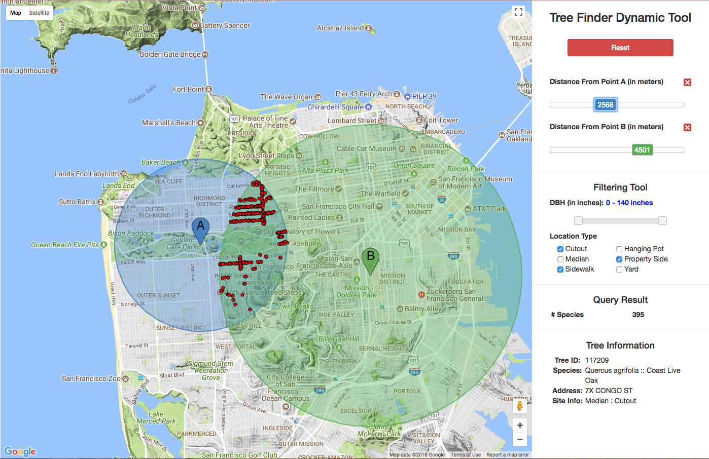

# Tree-Finder-Dynamic-Tool

Our web application takes advantage of the Google Maps API to enable anyone to interact with data pertaining to trees found in San Francisco. We allow curious lovers of trees and data to filter by the tree diameter at breast height (in inches) and by the location type (Cutout, Median, Sidewalk, Hanging Pot, Property Side and Yard). Furthermore, data geeks can select any one or two points on the map and filter trees that are within a certain distance in meters of those points. (Pro Tip: You can also update the location of the selected points on the visualization by dragging and dropping their map pins.) Finally, to start over, simply click on the big red "Reset" button to start over!

### Instructions

For best experience, please use the latest Chrome browser version with the screen size of at least 1024-by-640 pixels. You can place two pinpoints by simply click on buttons 'Select Pinpoint A' and 'Select Pinpoint B' and drop the pinpoint in the google map. The default distance from each pinpoint is 3500 meters in world scale metric. You can adjust the distance by sliding the bar on the right side. Notice that the slider is very sensitive. If you click on the value that is higher than the current value and drag on the left, you will see the quick red dot quickly pop up outside the bound and then disappear according to your adjustment. Another way to change the distance is to click on the slider button and put left and right on the keyboard. This will adjust the value with a step size of 1. In addition to distance adjustment, you can drag the pinpoint directly on the map. Note that the red dot will only update once the drag is over (leave your mouse up). All the red dot will be updated within 0.1 second while the circle will update slightly slower due to binding object in Google API. In case you want to remove a specific pinpoint, you can click on the red cross button close to slider bar.

Apart from using pinpoints, you can filter the Diameter at Breast Height (DBH) in inches from 0 and 140 with the similar fashion as adjusting distance. Not only that, you can also adjust the location type by selecting the check box on the right and the trees in the map will automatically update as you need.

If you want to start over the entire filtering, you can click reset button. This will remove all pinpoints, set the DBH filtering to 0 - 140, check all the location type, and all trees will appear on the map like when you first enter the page.

### Website

This website can be view at [http://web.stanford.edu/~pakapark/cs448b-a3/](http://web.stanford.edu/~pakapark/cs448b-a3/)

### Sample Image

### Implementation Time
1 day
